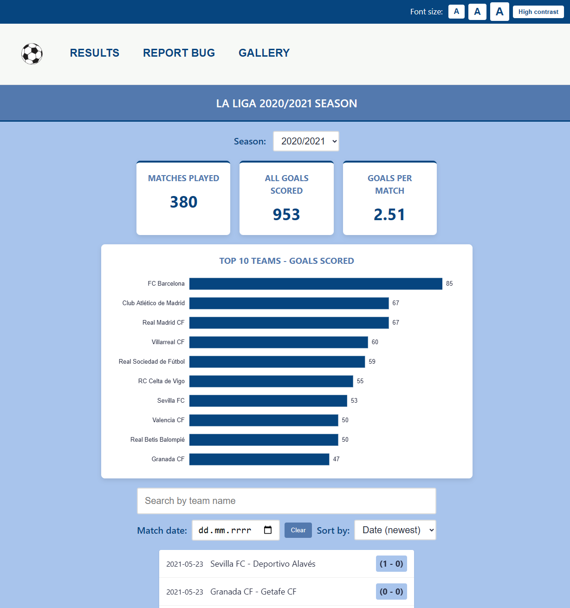
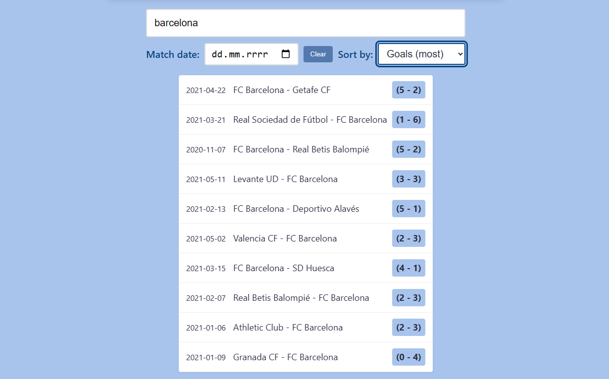
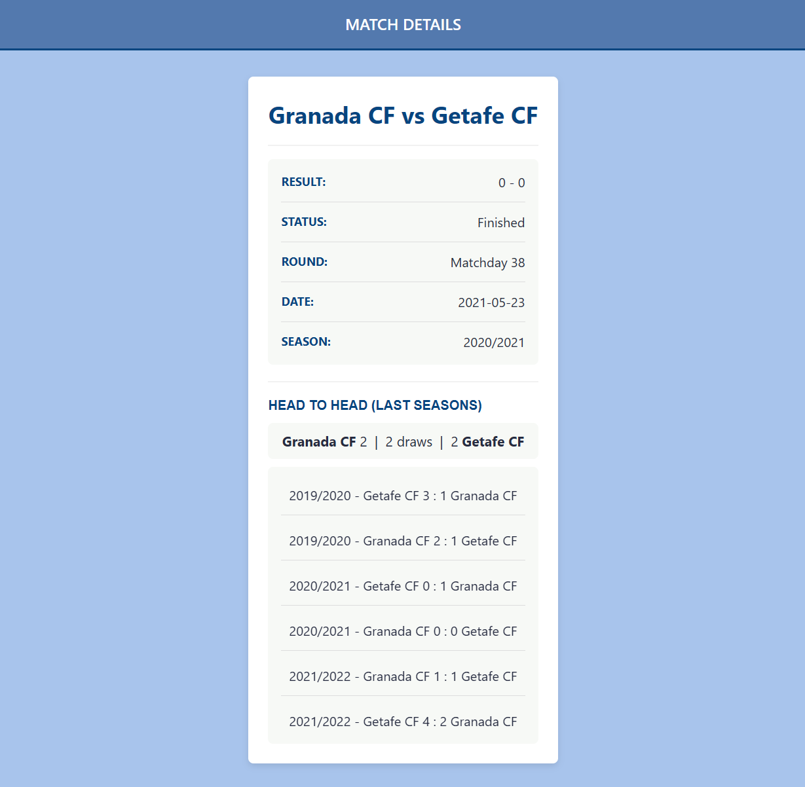
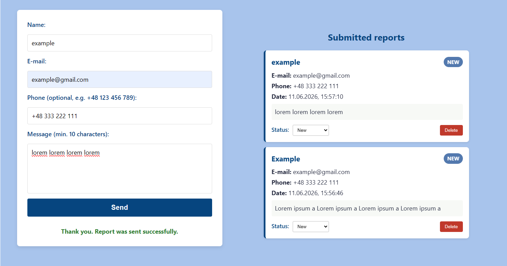
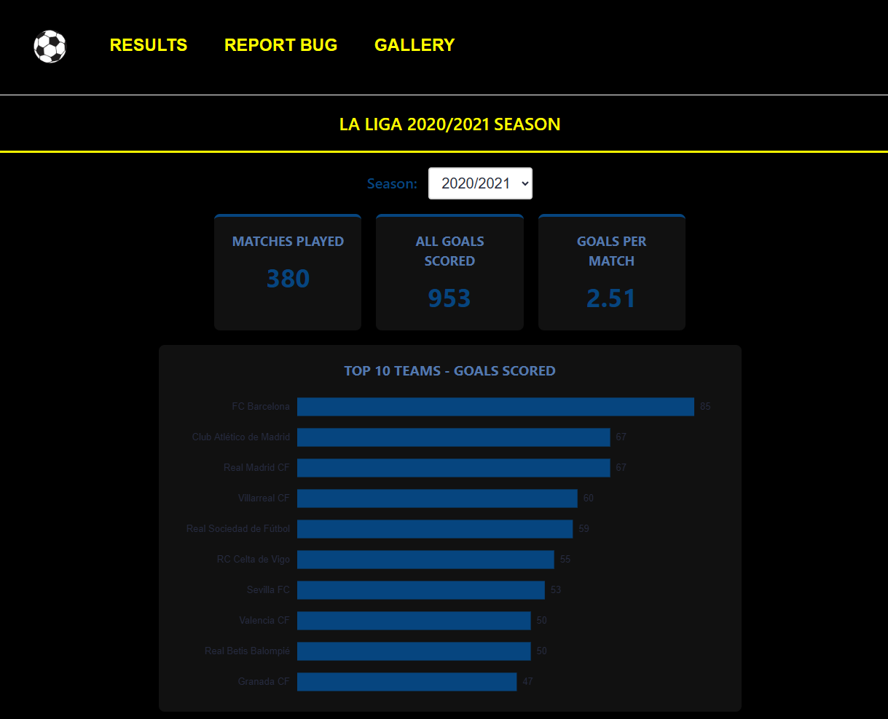

# Dokumentacja Projektu: Aplikacja "La Liga Results"

## 1. Wstęp i cel projektu

Głównym celem projektu było stworzenie interaktywnej aplikacji internetowej w technologiach HTML, CSS oraz JavaScript. Aplikacja służy do przeglądania wyników ligi piłkarskiej (La Liga), analizowania statystyk, sprawdzania historii spotkań pomiędzy wybranymi drużynami (H2H), a także umożliwia kontakt z administracją poprzez formularz oraz przeglądanie galerii zdjęć.

---

## 2. Przegląd najważniejszych widoków i funkcji

### 2.1. Strona Główna - Lista wyników i statystyki

Strona główna (`index.html`) stanowi centrum informacyjne aplikacji. Dane pobierane są asynchronicznie za pomocą `fetch API`.

**Kluczowe mechanizmy**

- Wykres na Canvas - Aplikacja rysuje wykres słupkowy "Top 10 drużyn według strzelonych goli" przy pomocy elementu `<canvas>` oraz funkcji `calculateStats()` i `drawChart()`.

- Dynamiczne filtry i paginacja - Użytkownik może wyszukiwać mecze po nazwie drużyny i dacie, a także sortować wyniki. Zastosowano paginację ("Load more matches").

> _Wykres renderowany w elemencie Canvas, który przedstawia top 10 drużyn z największą ilością zdobytych goli._

> _Interfejs wyszukiwania po nazwie, dacie oraz sortowanie po dacie i ilości zdobytych goli._

### 2.2. Szczegóły Meczu i historia spotkań (H2H)

Widok szczegółów (`mecz.html`) generowany jest na podstawie parametrów przekazanych w adresie URL (obiekt `URLSearchParams`).

**Kluczowe mechanizmy**

- Równoległe zapytania do API - Skrypt wykorzystuje `Promise.all()` do jednoczesnego pobrania danych z 4 różnych sezonów ligowych. Następnie dane są agregowane i filtrowane w celu wyliczenia historycznego bilansu spotkań między dwiema wybranymi drużynami.

> _Widok szczegółów oraz zestawienie historii spotkań H2H z poprzednich sezonów._

### 2.3. Formularz kontaktowy i zarządzanie zgłoszeniami

Podstrona kontaktowa (`kontakt.html`) służy do zgłaszania błędów, jednak działa jako w pełni funkcjonalny panel z zapisem po stronie klienta (`localStorage`).

**Kluczowe mechanizmy**

- Złożona walidacja - Zastosowano RegEx do sprawdzania poprawności adresu e-mail, numeru telefonu (dopuszczanie kierunkowych, spacji, myślników) oraz formatu imienia.
- Obsługa localStorage - Zgłoszenia są zapisywane w `localStorage`. Interfejs umożliwia ich przeglądanie, zmianę statusu ("New", "In progress", "Resolved") oraz usuwanie. Funkcja (`migrateOldReports()`) jest odpowiedzialna za sprawdzanie zgodności starych danych (sprawdza czy stare dane posiadały `report.id` oraz `report.status`).

> _Formularz z komunikatami walidacji i dynamicznie generowaną listą zgłoszeń pobierana z localStorage._

---

## 3. Dostępność

Aplikacja została przystosowana dla osób o specjalnych potrzebach. Wstrzykiwany globalnie skrypt `accessibility.js` zapewnia:

- Pasek dostępności - Możliwość skalowania wielkości czcionki (`root font-size`) oraz włączenia trybu wysokiego kontrastu (zmiana schematu kolorów całej aplikacji). Ustawienia te są utrwalane w `localStorage`.
- Elementy interfejsu (takie jak przyciski w pasku czy statusy) są poprawnie opisywane dla czytników ekranu.

Dodatkowo, na podstronie z galerią (`galeria.html`) zaimplementowano własną karuzelę zdjęć (slider), która jest w pełni responsywna i może być obsługiwana z poziomu klawiatury (strzałki).

> _Interfejs aplikacji po uruchomieniu trybu "High Contrast" i powiększeniu czcionki._

---

## 4. Architektura i jakość kodu

Projekt charakteryzuje się modularną architekturą:

- Kod JavaScript został podzielony oddzielne pliki, logiczne części, odpowiadające konkretnym widokom.
- Zastosowano nowoczesny standard ES6 (m.in. domknięcia, template literals, zaawansowane metody tablicowe jak `.reduce()` czy `.map()`).
- Tablice wykorzustują nowe metody typu `.map()`, żeby przerabiać elementy tablicy na nowe oraz `.reduce()` aby zwijać całe tablice.
